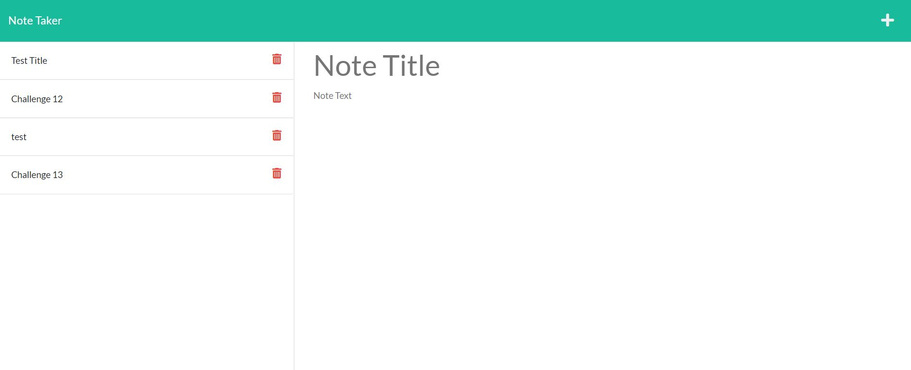

# Note Taker Express

## Purpose
This application is designed to help the user keep track of tasks that need to be completed. The user is first directed to a landing page with a link to the notes page. Once the user has clicked into the notes page, they are able to enter a new note title and note text. The user then clicks on the save icon in the upper right corner. The note is then moved to the left-hand column and the user is able to input another note. 

## Built With
*HTML
*CSS
*JS
*Node
*Express

## Web Link
https://andrea-rowland.github.io/note-taker-express/

## Screenshot:

